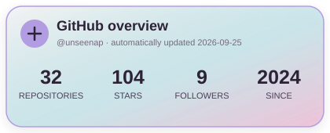
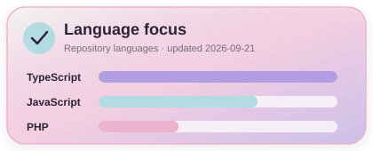
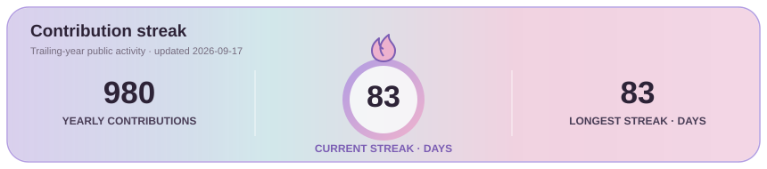

<div align="center">


[](https://git.io/typing-svg)

[](https://github.com/unseenap)
[](https://www.linkedin.com/in/abhishek-prajapati-9b049728a/)
[](mailto:abhi.prajapati2005@gmail.com)

</div>

## `> whoami`

```typescript
const abhishek = {
  location: "Greater Noida, India",
  education: "B.Tech CSE @ Gautam Buddha University (2023–2027)",
  roles: ["Full-Stack Developer", "Backend Developer", "Automation Builder"],
  building: [
    "dependable web applications",
    "role-based systems",
    "workflow automation",
  ],
  focus: ["backend engineering", "automation", "production systems"],
  principle: "Build software that solves a real human problem.",
};
```

<<<<<<< HEAD
I’m a final-year Computer Science student and full-stack developer who enjoys turning manual workflows into dependable web applications. I build and deploy role-based platforms with hands-on work across authentication, databases, real-time features, testing, automation, SEO, and production delivery.

## Experience

### Web Developer Intern · [Cawnpore Engineering Services](https://www.ceservices.co.in/)

`React.js` `JavaScript` `Responsive Design` `SEO` · **Jun–Jul 2026**

- Developed and launched the company website for HVAC design, installation, commissioning, maintenance, and system-upgrade services across India.
- Built responsive pages for services, industries, completed projects, and the company’s engineering approach.
- Managed on-page SEO, deployment updates, and ongoing website operations during the two-month paid internship.

[](https://github.com/unseenap/CawnporeEngineeringServices)
[](https://www.ceservices.co.in/)
=======
I’m a Computer Science undergraduate who enjoys owning the full product journey-from database architecture and secure REST APIs to responsive interfaces and real-time experiences. My current focus is building **reliable automation, backend systems, and streamlined workflows**.
>>>>>>> 8e2a7635dfaf5ad7a67d63540ad859cab6de1452

## Tech constellation

<div align="center">

|                                       Core                                       |                                             Frontend                                             |                                  Backend                                   |                                  Data                                   |                                                   Cloud & Tools                                                    |
| :------------------------------------------------------------------------------: | :----------------------------------------------------------------------------------------------: | :------------------------------------------------------------------------: | :---------------------------------------------------------------------: | :----------------------------------------------------------------------------------------------------------------: |
|  |  |  |  |  |

</div>

## Selected work

<table>
<tr>
<td width="50%" valign="top">

### 🧠 [BodhiMitra](https://github.com/unseenap/Bodhi-Mitra)

**Real-time mental-health support platform** connecting students and psychologists through emergency matching and live sessions.

`React 19` `Node.js` `Express` `Socket.io` `MongoDB`

- JWT authentication, OTP verification, and three-role RBAC
- 20+ REST endpoints, crisis-keyword detection, ratings, and notifications
- Property-based tests for auth, chat ordering, and emergency-state transitions

[](https://bodhimitra.gbu.ac.in)

</td>
<td width="50%" valign="top">

### 🎓 [Auto-Examination](https://github.com/unseenap/Auto-Exam-Main)

**Examination operations platform** for scheduling, seat allocation, invigilation, attendance, and reporting.

`PHP` `MySQL` `JavaScript` `XAMPP`

- Role-based workflows for Admin, Exam Cell, and Faculty users
- Multi-branch seating allocation with manual adjustments and validated CSV imports
- Normalized MySQL schema with transaction-safe operations and report exports

  [](https://gbuexam.gt.tc)

</td>
</tr>
<tr>
<td width="50%" valign="top">

### 🎯 [CredX](https://github.com/unseenap/CredX-SmartJobMatchingDash-master)

**Explainable job and internship matching platform** that ranks opportunities using skills, GPA, and work-authorization signals.

`Next.js 16` `TypeScript` `MongoDB` `Groq AI`

- Transparent 0–100 matching score with visible reasoning
- Resume processing for PDF, DOCX, and image uploads
- Student application tracking and recruiter-management workflows

[](https://cred-x-smart-job-matching-dash.vercel.app/)

</td>
<td width="50%" valign="top">

### 📸 [CarouselQueue](https://github.com/unseenap/CarouselQueue)

**Instagram publishing automation pipeline** that converts queued content into scheduled four-slide carousel posts.

`Python 3.12` `Instagram Graph API` `Cloudinary` `GitHub Actions`

- Validates image inputs, assembles carousel media, uploads assets, and publishes through the Instagram API
- Includes dry-run previews, automated tests, and alternating queue selection
- Prevents duplicate posts and tracks local publishing state without storing repository credentials

</td>
</tr>
<tr>
<td colspan="2" valign="top">

<<<<<<< HEAD
### 🗺️ [Intelligent Land Record Digitization](https://github.com/unseenap/Land_dizitization)
=======
### 🧬 [ForkIT · FlavorBoost](https://github.com/unseenap/FlavorBoost)
>>>>>>> 8e2a7635dfaf5ad7a67d63540ad859cab6de1452

**Role-scoped document workflow** that keeps source files, OCR evidence, corrections, approvals, and audit history connected.

`Next.js` `TypeScript` `PostgreSQL` `Drizzle ORM`

- Validation and duplicate-review workflows with durable processing jobs
- Immutable approval snapshots, scoped search, and clear human-verification boundaries
- Architecture prepared for separately deployed OCR and government integrations

[](https://flavorboost.vercel.app)
</td>
</tr>
</table>

## Engineering snapshot

<div align="center">







</div>

## Highlights

<div align="center">


[](https://ude.my/UC-9e4a3cde-a9b9-4d28-8f74-45694ef5fceb)

</div>

## Contribution journey

<div align="center">

<picture>
  <source media="(prefers-color-scheme: dark)" srcset="https://raw.githubusercontent.com/unseenap/unseenap/gh-pages/github-snake-dark.svg" />
  <source media="(prefers-color-scheme: light)" srcset="https://raw.githubusercontent.com/unseenap/unseenap/gh-pages/github-snake.svg" />
  
</picture>

</div>

## Let’s build something meaningful

I’m open to collaborating on **full-stack products, backend systems, workflow automation, developer tools, and production web platforms**. If an idea combines thoughtful engineering with genuine human impact, I’d love to hear about it.

<div align="center">

[](mailto:abhi.prajapati2005@gmail.com)


</div>
